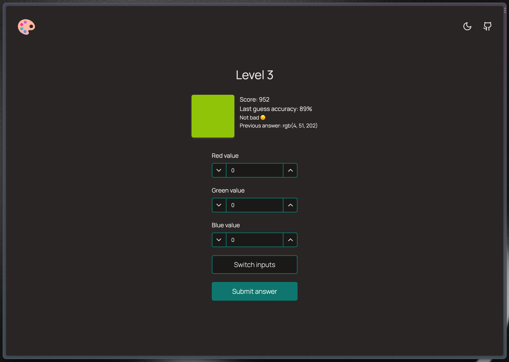

# coloruiz

This is a simple color guessing game built with newest Next.js stuff. You're presented a random color and your goal is to guess its RGB values.

It uses many bleeding-edge stuff, therefore, I'm not fully happy with the implementation. I'm probably going to polish some stuff when they're fixed inside of Next.js

## Live version

You can check out the game [here](https://coloruiz.pawelblaszczyk.dev/).

## Functionalities

- Color guessing game
- Server-side game state handling
- Dark/light themes
- Fully keyboard navigable and accessible

## Technologies

- React
- Next.js (app router + server actions)
- TypeScript
- Tailwind
- Ark UI
- Zod
- Houseform

## Run it locally

- Clone repo
- Make sure `pnpm` is installed
- Run `pnpm i`
- Run `pnpm dev`

## Feedback

Any feedback is appreciated. Feel free to head me up.

## License

[MIT](https://choosealicense.com/licenses/mit/)
